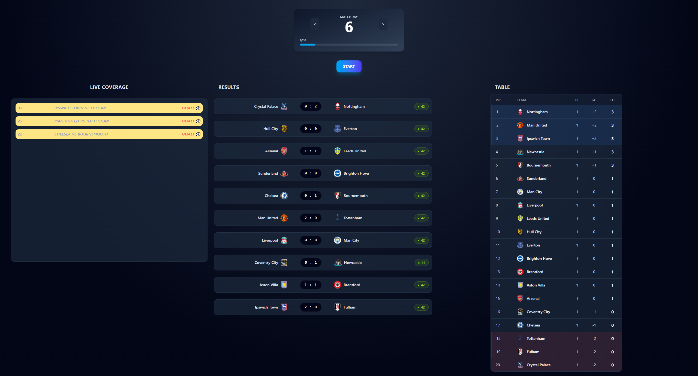

# Premier League Simulator ⚽️

A distributed, event-driven system designed to simulate football matches in real-time. This project focuses on handling high-throughput data streams, efficient caching strategies, and robust microservices communication.

> **Note:** This project started as a **backend-focused showcase**. It now ships with a dedicated **React + Tailwind CSS** frontend that visualizes the real-time data flow and the **event-driven architecture** (Kafka, Redis, WebSockets) live in the browser.
---

## 🏗 Architecture & Data Flow

The system consists of three main services orchestrated via **Docker**:

### 1. Main App
- **Data Ingestion:** Fetches initial data (teams/fixtures) from the [football-data.org](https://www.football-data.org/) REST API.
- **State Management:** Manages the league state and user interactions.
- **Real-time Gateway:** Acts as a **WebSocket** server to push live updates to the UI.
- **Persistence Logic:** Periodically flushes data from Redis to **PostgreSQL**.

### 2. App-Worker (Simulation Engine)
- **Scalability:** A consumer-producer service designed to scale horizontally.
- **Simulation:** Generates match events (minutes, goals, table updates).
- **Parallelism:** Multiple instances work in parallel, processing different matches simultaneously.

### 3. Frontend
- **Live Dashboard:** A React SPA that renders matches, live scores, a goal-by-goal log, and the league table.
- **REST + WebSocket Client:** Fetches initial state from Main App's REST API, then subscribes over **STOMP/WebSocket** (`/topic/match-logs`, `/simulation/match-update`, `/simulation/table-update`) to merge in live deltas without polling.
- **Styling:** Built with **Tailwind CSS v4** for a responsive, dark-themed UI.

### Key Architectural Decisions
* **Kafka Partitioning:** Events are produced with `matchId` as the message key. This guarantees that all events for a specific match are processed in chronological order by the same worker instance.
* **Write-Behind Caching:** To minimize database overhead, match updates are cached in **Redis** and synchronized with **PostgreSQL** every 10 minutes or upon match completion.
* **Live Updates:** Utilizes **WebSockets (STOMP)** to provide a "Live Score" experience, eliminating the need for client-side polling.

---

## 🛠 Tech Stack

| Layer | Technology                                                         |
| :--- |:-------------------------------------------------------------------|
| **Backend** | Java 21, Spring Boot 4.0.3, Spring Data JPA                        |
| **Messaging** | Apache Kafka                                                       |
| **Caching** | Redis (Hashes & Sorted Sets)                                       |
| **Database** | PostgreSQL                                                         |
| **Migrations** | Flyway                                                             |
| **DevOps** | Docker, Docker Compose                                             |
| **Frontend** | React 19, TypeScript, Vite, Tailwind CSS, STOMP (`@stomp/stompjs`) |

---

## 🚀 Key Features

* **Parallel Processing:** Demonstration of 3 Worker replicas showing how Kafka partitions allow the simulation engine to scale.
* **Advanced Redis Usage:** 
  * `opsForHash`: Storing detailed, structured match objects.
  * `opsForZSet`: Maintaining a self-sorting live league table based on points.
* **Database Versioning:** Full control over the schema through **Flyway** migrations, moving away from `hibernate.ddl-auto`.
* **Reliability:** **Docker Healthchecks** ensuring the application starts only when PostgreSQL and Kafka are fully operational.
* **Testing:** Unit, web, and integration test coverage (**JUnit 5**, **Mockito**, **Testcontainers**) for the simulation logic and Kafka/Redis interactions.
* **Accurate Standings:** League table sorting handles tie-breaking by goal difference and matches played, not just points.

---
## 💻 Application Interface (Premier League Simulator)

The image below showcases the live dashboard of the simulation:

 

### Key UI Components Explained:

1.  **Results (Live Scores):** Shows current scores and match minutes, updated via WebSockets.
2.  **Live coverage:** A real-time log of goals, including the minute and the teams involved.
3.  **Live Table:** An automatically sorted league table (powered by Redis Sorted Sets).

---

## 🔧 Installation & Running

### Prerequisites
* Docker & Docker Compose installed.
* API Key from [football-data.org](https://www.football-data.org/).

### Setup
1. **Clone the repository:**
   ```bash
   git clone https://github.com/SudsyHickory/PLApp.git
   cd PLApp
2. **Configure Environment:**
   Create .env file in the root directory and add your API Key:
    ```bash
   FOOTBALL_API_KEY=your_key_here
3. **Run via Docker:**
    ```bash
   docker-compose up --build
This starts Postgres, Kafka, Redis, the Main App, 3 App-Worker replicas, and the Frontend.

- Main App: http://localhost:8080
- Frontend: http://localhost:5173

## 📈 Future Roadmap

- [ ] **Frontend Testing:** Add a Vitest + React Testing Library suite for frontend components and hooks (currently no test setup on the frontend).
- [ ] **Match Replay System:** Leveraging **Kafka Streams** to allow replaying and analyzing match event topics